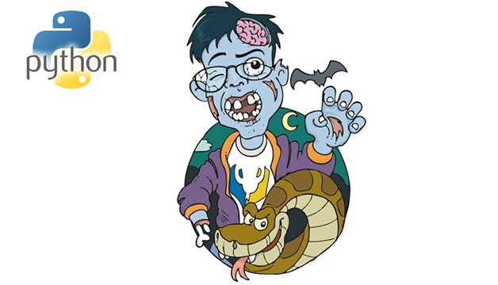
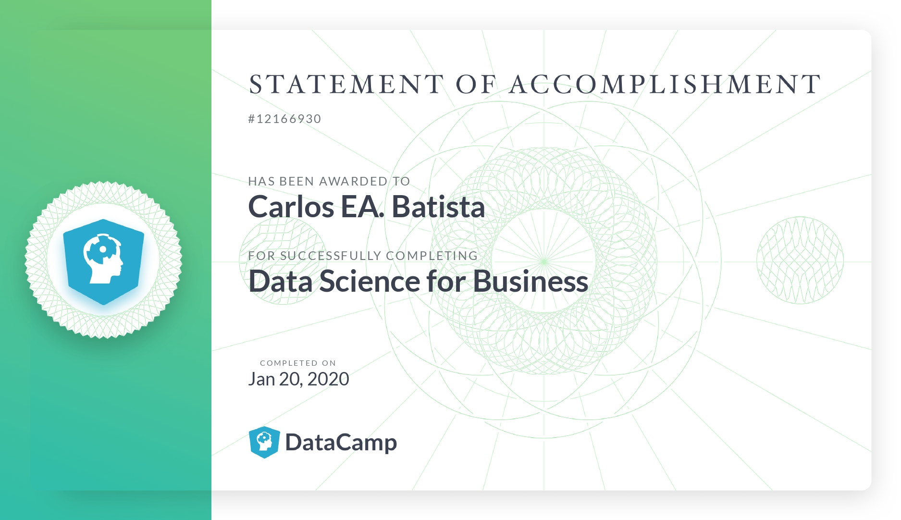

É. Eu sei. 

2020 já está voando e você ainda não cumpriu a sua resolução de ano-novo de começar aprender à programar em Python.

<blockquote class="twitter-tweet">
▓░░░░░░░░░░░░░░ 6%
&mdash; Year Progress (@year_progress) <a href="https://twitter.com/year_progress/status/1220134051253825536?ref_src=twsrc%5Etfw">January 23, 2020</a></blockquote> 

Mas, _não se desespere_! Pensando nisso, criei um compilado de lugares pra aprender à programar em Python que são um pouco mais desconhecidos e têm uma qualidade excepcional.

---

**Cursos e Video-Aulas**

- Python para Zumbis | Fernando Masanori

A primeira recomendação é o curso [Python para Zumbis do Fernando Masanori](https://www.youtube.com/playlist?list=PLUukMN0DTKCtbzhbYe2jdF4cr8MOWClXc).

Esse curso foi um dos primeiros MOOC's (Massive Open Online Course) para ensino de programação em língua portuguesa e até hoje continua uma boa porta de entrada para a linguagem Python. Ele difere um pouco da abordagem tradicional (Coursera, EDx, etc), pelo tom mais "informal" sem perder o rigor técnico.

E não é pra menos, o professor é Docente da FATEC São José dos Campos e é amplamente conhecido por [ministrar seu curso pela Python Software Foundation ao redor do globo](https://medium.com/@fmasanori/minha-experi%C3%AAncia-na-pycon-nam%C3%ADbia-e8e5a5227ab0?source=---------6------------------).

- Trilha Programador(a) Python | DataCamp

O DataCamp é uma plataforma especializada em aprendizado de conteúdo para Data Science. Na plataforma,você pode realizar cursos interativos, fazer projetos para solidificar seu aprendizado. E o melhor,além do material incrível, acabando o curso você ganha um certificado bonitão e extremamente conceituado para solidificar sua carreira.

Vish, mas eu vi aqui e é pago. _E agora?_ Calma, calma, fica tranquilo(a), olha a oportunidade: você pode ter o Premium na plataforma por alguns meses! Para isso, você pode obter dois meses gratuitos pelo [pacote para desenvolvedores da Microsoft](https://visualstudio.microsoft.com/dev-essentials/) (que pode ser ativo através de qualquer e-mail outlook) ou, ainda, você pode conseguir três meses gratuitos pelo [pacote para estudantes do Github](https://education.github.com/discount_requests/new) - que tem aliás, muita coisa legal incluída, [como um programa de embaixadores da empresa](https://education.github.com/students/experts). Recomendo total.

- Introduction to Python | Front-End Masters

Ainda pelo Github Student Pack, você pode obter acesso aos cursos do [Front-End Masters](https://frontendmasters.com/). E embora, Python não seja o foco da plataforma, eu considero os cursos de [Introdução à Python](https://frontendmasters.com/workshops/intro-to-python/) e [Python Intermediário](https://frontendmasters.com/courses/intermediate-python/) da Nina Zakharenko, um dos melhores, senão o melhor curso online para aprender à programar na linguagem. Você pode encontrar um preview do material gratuitamente no [website do curso](https://www.learnpython.dev/).

- Live de Python | Eduardo Mendes

Embora, em geral, os conteúdos da [Live de Python](https://www.youtube.com/user/mendesesduardo) costumam focar em um público mais intermediário, foi só aqui que eu senti que aprendi a programar de verdade e eu acho que é, sem dúvidas, um material adicional para você utilizar durante seu primeiro curso em programação.

<iframe width="560" height="315" src="https://www.youtube.com/embed/EK42cKmIRP4" frameborder="0" allow="accelerometer; autoplay; encrypted-media; gyroscope; picture-in-picture" allowfullscreen></iframe>

Sério, se eu ficasse até o final de dezembro aqui rasgando elogios por texto para o material do Du, ainda assim, não seria suficiente. Além de ensinar com uma pureza técnica maravilhosa, a linguagem é extremamente acessível e parece que você tá simplesmente aprendendo o conteúdo com um amigo que tá do seu lado. Só vai.

- *Menções Honrosas*:

[Python para Todos | University of Michigan | Coursera](https://pt.coursera.org/learn/python)   
[Introduction to CS and Programming in Python | MIT](https://www.youtube.com/watch?v=nykOeWgQcHM&list=PLUl4u3cNGP63WbdFxL8giv4yhgdMGaZNA)    
[Introdução à Ciência da Computação com Python | USP](https://pt.coursera.org/learn/ciencia-computacao-python-conceitos)  
   
[CodeShow | Bruno Rocha](https://www.youtube.com/user/brunovegan)

---

**Livros**

Se você for como eu, não consegue substituir o bom e velho livro independente se fez mil cursos online da linguagem. Sendo assim, cito os dois livros que são boas portas de entradas para a linguagem Python.

- Pense em Python | Allen B. Downey

Se você nunca aprendeu à programar. Esse é o livro pra começar. Além de estar [disponível online gratuitamente](https://penseallen.github.io/PensePython2e/), ele aborda todos os conceitos importantes para um iniciante da linguagem: I/O, estruturas de seleção, repetição, containers (listas,dicionários, conjuntos e tuplas), funções e o básico de orientação à objetos.

- Composing Programs | John DeNero

Aqui está uma alternativa ao livro acima. Também [disponível online do jeito 0800](http://composingprograms.com/), ele é um pouco mais robusto, de modo que passará por conceitos mais avançados e segue uma linha não tão usual para aprendizado da linguagem. Muito disso se dá pela sua origem baseada no Structure and Interpretation of Computer Programs (SICP) de Harold Abelson e Gerald Jay Sussman, que é, sem dúvidas, um dos livros (e cursos) mais importantes da história da Ciência da Computação. Se você completar esse livro entendendo todos os conceitos, sem dúvidas, você aprendeu à programar em python.

- *Menções Honrosas (...ou leituras mais intermediárias/avançadas)*:

[Automate the Boring Stuff with Python | Al Sweigart](https://automatetheboringstuff.com/)  
[Python Cookbook | David Beazley](https://www.amazon.com.br/Python-Cookbook-David-Beazley/dp/8575223321/)  
[Dive into Python3 | Mark Pilgrim](https://diveintopython3.problemsolving.io/)  
[O Guia do Mochileiro Python | Kenneth Reitz](https://python-guide-pt-br.readthedocs.io/pt_BR/latest/)  
[Python Fluente | Luciano Ramalho](https://www.amazon.com.br/Python-Fluente-Programa%C3%A7%C3%A3o-Concisa-Eficaz/dp/857522462X) 

--- 

**Comunidades e Eventos**

Python tem uma das comunidades mais inclusivas para novos(as) pessoas desenvolvedoras. Não é atoa que o lema é _"Pessoas > Tecnologia"_. E, em função disso, entrar em contato com as comunidades pode ser um ponto de inflexão no seu aprendizado.

Para se integrar mais, você pode entrar nos [grupos do telegram](https://github.com/alexmoreno/telegram-br) da linguagem (a galera é super receptiva com dúvidas!) e pode frequentar eventos da comunidade. Dá uma olhadinha pelo [Meetup](https://www.meetup.com/pt-BR/). Provavelmente há um evento do GruPy, do SciPy ou do PyData agendado para os próximos dias! Além disso,você ainda pode utilizar o próprio site da linguagem para verificar eventos regionais ou nacionais. 

